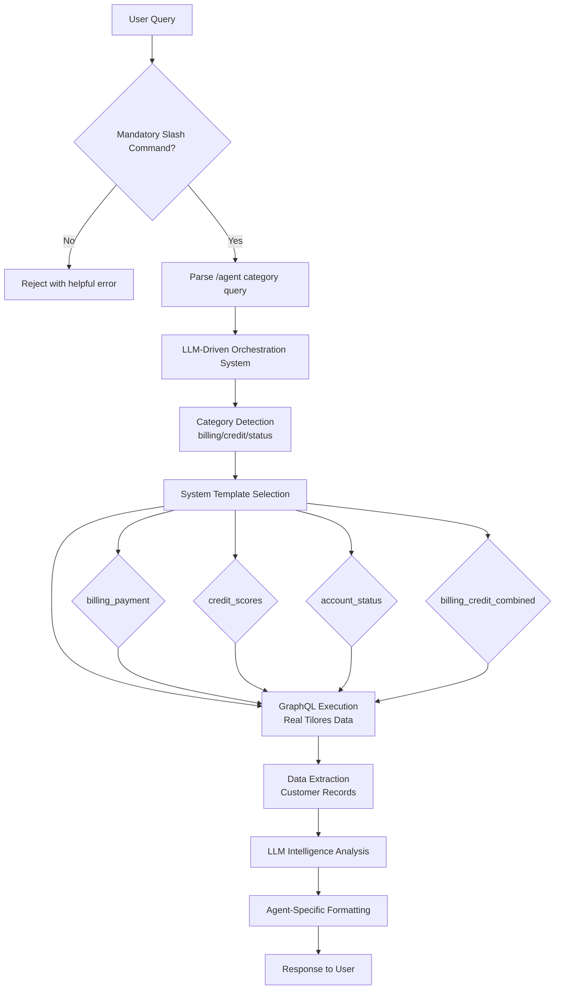
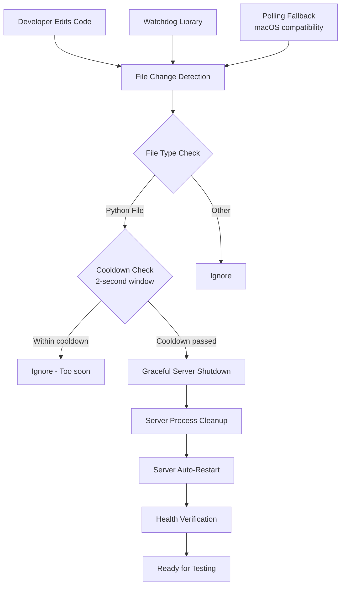
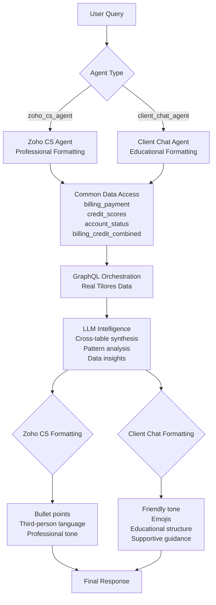
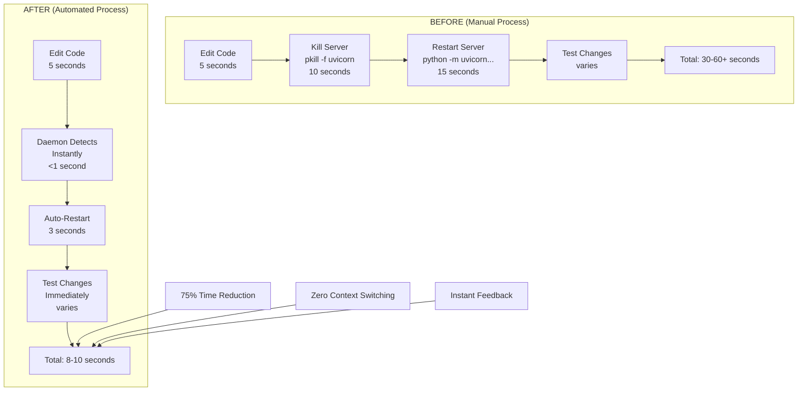
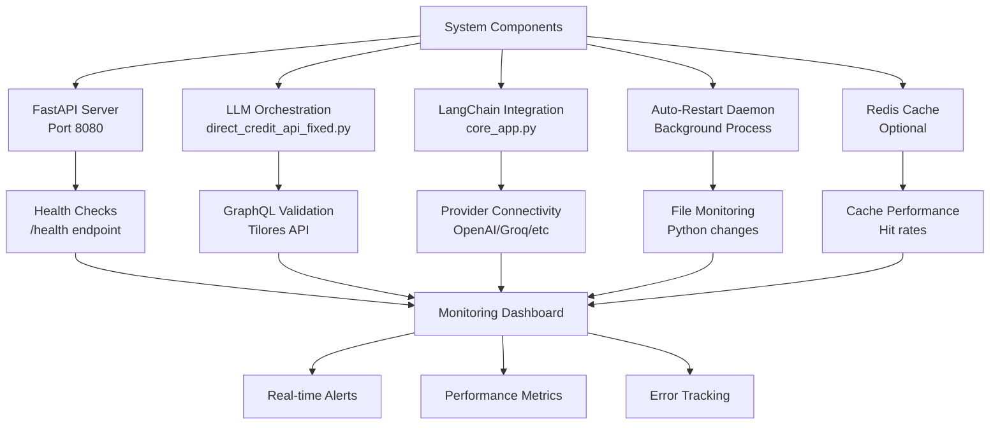
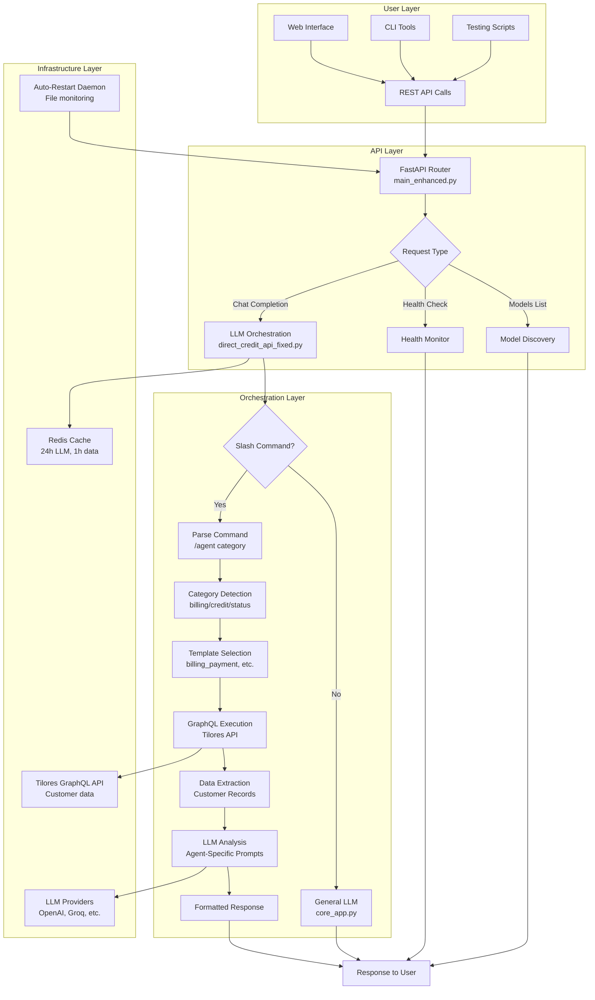

# Tilores_X Architecture Diagrams

## Current Architecture: LLM-Driven Orchestration (September 2025)

### Core System Flow



### Auto-Restart Development Daemon



### Multi-Threaded Query Processing

```mermaid
graph TB
    A[Concurrent User Queries] --> B{Slash Command Detection}
    B --> C1[/cs billing Query #1]
    B --> C2[/cs status Query #2]
    B --> C3[/client billing Query #3]

    C1 --> D1[LLM Orchestration #1<br/>billing_payment template]
    C2 --> D2[LLM Orchestration #2<br/>account_status template]
    C3 --> D3[LLM Orchestration #3<br/>billing_payment template]

    D1 --> E1[GraphQL Query #1<br/>Transaction Data]
    D2 --> E2[GraphQL Query #2<br/>Account Data]
    D3 --> E3[GraphQL Query #3<br/>Transaction Data]

    E1 --> F1[LLM Analysis #1<br/>Zoho CS Formatting]
    E2 --> F2[LLM Analysis #2<br/>Zoho CS Formatting]
    E3 --> F3[LLM Analysis #3<br/>Client Chat Formatting]

    F1 --> G1[Response #1<br/>2.3s total]
    F2 --> G2[Response #2<br/>2.0s total]
    F3 --> G3[Response #3<br/>2.4s total]

    G1 --> H[All Responses<br/>Delivered Concurrently]
    G2 --> H
    G3 --> H
```

### Agent Intelligence Architecture



### Development Workflow Improvement



### System Health Monitoring



### Data Flow Architecture


