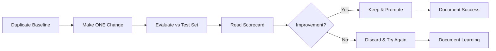
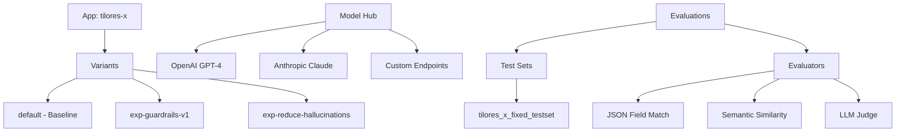
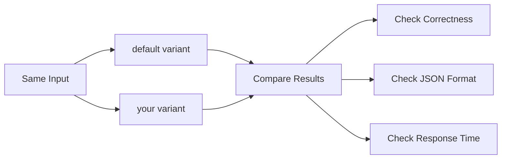
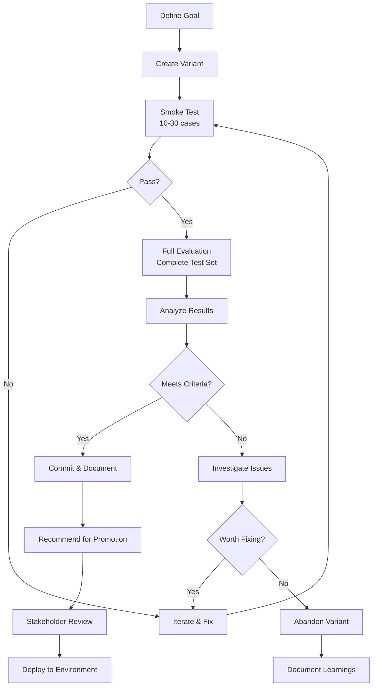
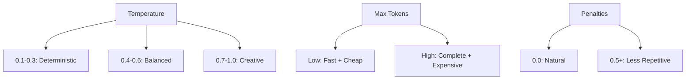
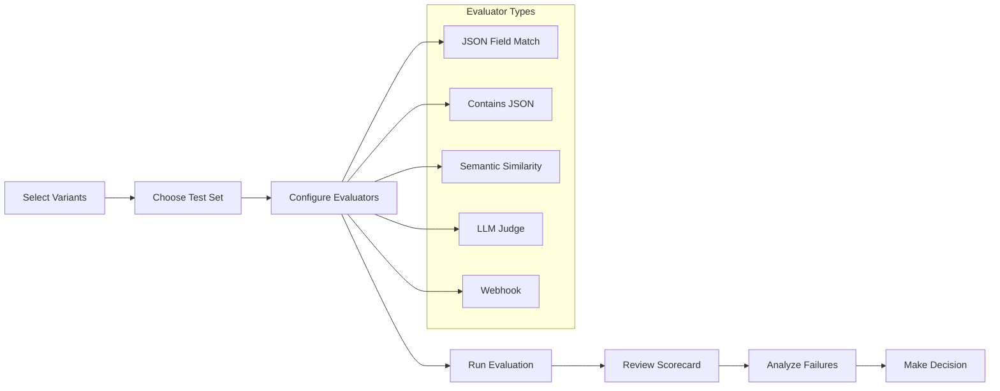
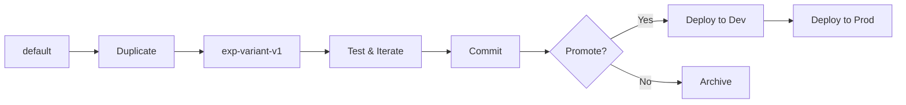
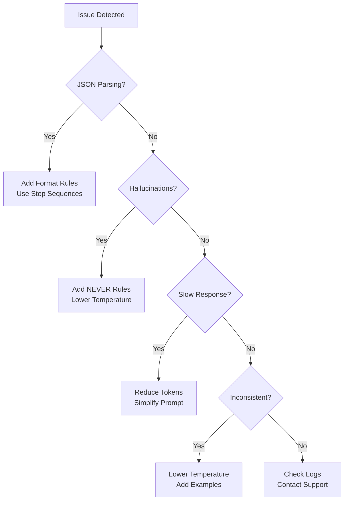
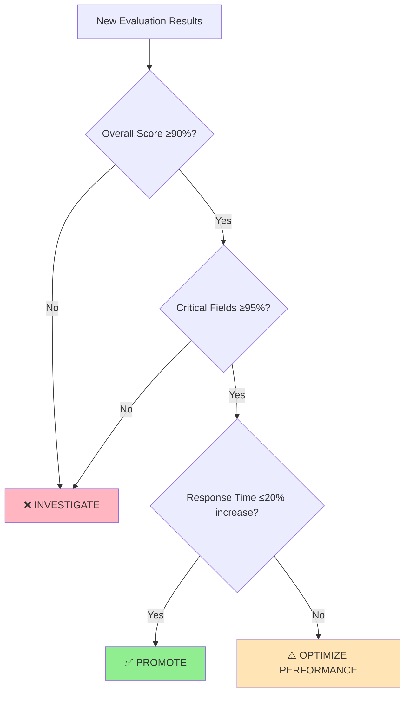
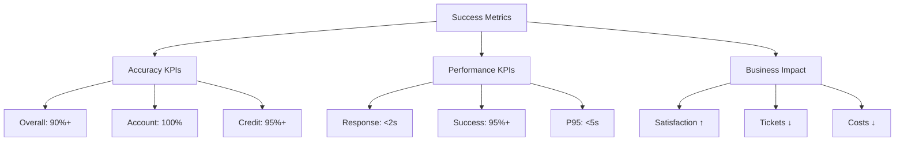

# 🎯 **AGENTA TEAM PLAYBOOK – TESTING & ITERATION**

## _Enhanced Consolidated Guide for Non-Technical Teams_

**Audience:** Non‑technical testers, PMs, QA, and stakeholders
**Purpose:** A single, streamlined guide for evaluating, comparing, and improving Agenta apps/variants quickly and consistently.

---

## 🚀 **INTRODUCTION: WHY, WHAT, AND HOW**

### **Why We Use Agenta**

We use **Agenta** to bring rigor and speed to AI model iteration. It gives us:

- **🎯 Single Source of Truth** for prompts, models, and parameters
- **📊 Repeatable Testing Framework** with objective scorecards
- **🛡️ Guardrails** against regressions, hallucinations, and wasted spend
- **🤝 Collaborative Workspace** where non‑technical teammates can contribute safely

**The Goal:** Ship reliable, structured, and cost‑efficient AI behavior that aligns with business outcomes.

### **What This Process Delivers**

This is **systematic, low‑risk improvement**:



### **Your Agenta Toolkit**

You'll primarily use:

- **🎮 Playground** – create, compare, and **Commit** variants
  - 📖 [Playground Guide](https://docs.agenta.ai/prompt-management/using-the-playground)
- **🤖 Model Hub** – pick pre‑configured providers (incl. OpenAI‑compatible endpoints)
  - 📖 [Custom Providers](https://docs.agenta.ai/prompt-engineering/playground/adding-custom-providers)
- **📊 Evaluations** – run test sets with evaluators (JSON Field, Similarity, LLM‑judge, Webhook)
  - 📖 [Configure Evaluators](https://docs.agenta.ai/evaluation/configure-evaluators)

**Your Responsibility:** Follow the workflow, document findings, and recommend promotions when a variant demonstrates clear improvements. PM/QA leads approve **Deploy** to environments.

---

## 📋 **TABLE OF CONTENTS**

1. [Outcomes & Ground Rules](#1-outcomes--ground-rules)
2. [Key Concepts in Agenta](#2-key-concepts-in-agenta)
3. [Quick Start (30 minutes)](#3-quick-start-30-minutes)
4. [Standard Workflow](#4-standard-workflow-day-to-day)
5. [Prompt Patterns & Templates](#5-prompt-patterns--templates)
6. [Model Parameters](#6-model-parameters--practical-defaults)
7. [Evaluations Guide](#7-evaluations--choosing-the-right-checks)
8. [Naming & Versioning](#8-naming-versioning-and-promotion)
9. [Troubleshooting](#9-troubleshooting--fix-by-symptom)
10. [Reporting Template](#10-reporting-template)
11. [Decision Framework](#11-decision-framework)
12. [Success Metrics](#12-success-metrics)
13. [One-Page Checklist](#13-one-page-checklist)
14. [Glossary](#14-glossary)

---

## **1) OUTCOMES & GROUND RULES**

### **🎯 Primary Outcomes**

- **Reliable, structured outputs** (accuracy, faithfulness, consistency, latency)
- **Small, disciplined experiments** with proven improvements only
- **Data-driven decisions** replacing guesswork
- **Consistent quality** across all AI interactions

### **📏 Ground Rules**

- ✅ Change **one lever at a time** (prompt _OR_ model _OR_ parameters)
- ✅ Prefer **strict JSON outputs** for automated checks
- ✅ Keep `default` baseline pristine. Create variants for changes
- ✅ Always use the **canonical test set** for apples‑to‑apples comparisons
- ❌ Never deploy without evaluation
- ❌ Never make multiple changes simultaneously

---

## **2) KEY CONCEPTS IN AGENTA**

### **🏗️ Core Components**



### **🔧 Key Features**

- **Prompts with `{{curly_vars}}`** auto‑create input fields in Playground
- **Side-by-side comparison** for immediate visual feedback
- **Automated scoring** with multiple evaluator types
- **Version control** for all changes

> 💡 **Tip:** Start with the Playground to test ideas, then use Evaluations to validate at scale.

---

## **3) QUICK START (30 MINUTES)**

### **⏰ Minutes 1–5: Open & Duplicate Baseline**

1. Go to **Playground → Select app** (e.g., `tilores-x`)
2. **+Compare → New Variant → Duplicate from `default`**
3. Name clearly (e.g., `exp-guardrails-v1`)

### **⏰ Minutes 6–10: Choose Model & Set Parameters**

- Pick a provider/model from the dropdown
- Start with **temperature 0.2–0.3** for factual tasks
- Set reasonable **max tokens** (just above expected output size)

### **⏰ Minutes 11–15: Enforce Structured Output**

- Append: **"Return strict JSON with keys: … No extra text."**
- Add MUST/NEVER rules to reduce hallucinations
- Test with sample input to verify JSON format

### **⏰ Minutes 16–25: Side‑by‑Side Check**



Compare:

- ✅ Correctness of information
- ✅ JSON parseability
- ✅ Response latency
- ✅ Completeness of required fields

### **⏰ Minutes 26–30: Mini‑Evaluation**

- Run a **smoke test** (10–30 rows) with JSON‑Field + Similarity evaluators
- If your variant beats baseline with no regressions, **Commit**
- Document your changes and results

---

## **4) STANDARD WORKFLOW (DAY-TO-DAY)**

### **📋 Complete Testing Workflow**



#### **Step 1: Define the Goal**

- **Example:** "Reduce hallucinations in `explanation` while preserving `risk_flag` accuracy"
- Be specific about what you're trying to improve
- Set measurable success criteria

#### **Step 2: Create a Focused Variant**

- **Example:** `exp-reduce-hallucinations-t02`
- Make ONE change: adds MUST‑NOT invent rules; temperature=0.2
- Use descriptive naming that explains the change

#### **Step 3: Smoke Test**

- Test with 10–30 representative cases
- Check for obvious improvements or regressions
- Verify JSON structure and required fields

#### **Step 4: Full Evaluation**

Run the canonical dataset with:

- **JSON Field Match** (hard facts/labels)
- **Contains JSON** (parseability)
- **Semantic Similarity** (narratives)
- **Optional:** LLM‑as‑Judge or Webhook for nuanced scoring

#### **Step 5: Decision Making**

Promote only if:

- ✅ **Average score** improves by ≥3%
- ✅ **Key fields** maintain accuracy
- ✅ **Latency** is acceptable (≤20% increase)
- ✅ **No critical regressions**

#### **Step 6: Documentation**

Capture:

- Hypothesis and exact changes made
- Score deltas and field-level performance
- Trade‑offs and limitations discovered
- Recommended next steps

---

## **5) PROMPT PATTERNS & TEMPLATES**

### **🏗️ A) Structured JSON (Base Template)**

```
System: You are a precise assistant. Follow all MUST rules.

MUST:
- Use only the provided data
- Never invent missing fields
- Return strict JSON with keys:
  {
    "risk_flag": <"low"|"medium"|"high">,
    "utilization_pct": <number>,
    "late_payments_12m": <number>,
    "collections_open": <number>,
    "derogatories": <array>,
    "recommended_action": <"monitor"|"outreach"|"escalate">,
    "explanation": <string>
  }
- No extra text outside JSON

User: Summarize {{period}} risk for customer {{customer_id}} using provided context.
```

### **🛡️ B) Guardrails (Faithfulness)**

```
NEVER:
- Fabricate values not in the context
- Omit required JSON keys
- Output non‑JSON preambles or markdown fences
- Imply access to external systems if not provided
- Include personally identifiable information beyond provided inputs
```

### **📝 C) Narrative Quality (Short, Factual)**

```
Make the explanation:
- Concise (≤60 words)
- Reference the specific fields that drove the decision
- Use factual language, avoid speculation
- Include confidence indicators when appropriate
```

### **⚖️ D) Safety & Compliance (Optional)**

```
If information is missing:
- Include a JSON field "missing": [list_of_fields]
- Explain what is required to proceed
- Do not infer sensitive attributes
- Maintain data privacy standards
```

> 💡 **Tip:** Aim for deterministic JSON first. Deterministic structure unlocks cheaper, automated evaluators.

---

## **6) MODEL PARAMETERS – PRACTICAL DEFAULTS**

### **🎛️ Key Parameters**

| Parameter             | Factual Tasks              | Creative Tasks            | Notes                                  |
| --------------------- | -------------------------- | ------------------------- | -------------------------------------- |
| **Temperature**       | 0.2–0.3                    | 0.6–0.8                   | Lower = more deterministic             |
| **Max Tokens**        | Just above expected output | Higher for longer content | Lower reduces cost/latency             |
| **Top‑p**             | 1.0                        | 0.9–1.0                   | Leave at 1.0 unless shaping randomness |
| **Presence Penalty**  | 0.0–0.2                    | 0.2–0.5                   | Increase to reduce repetition          |
| **Frequency Penalty** | 0.0–0.2                    | 0.2–0.5                   | Increase to reduce repetition          |

### **🔬 Parameter Tuning Rules**

- **Change‑isolation rule:** When tuning parameters, keep the prompt fixed
- **Start conservative:** Begin with lower temperature, increase if needed
- **Monitor costs:** Higher max tokens = higher costs
- **Test incrementally:** Change one parameter at a time

### **Parameter Impact Visualization**



---

## **7) EVALUATIONS – CHOOSING THE RIGHT CHECKS**

### **🔧 Core Evaluators**

#### **JSON Field Match**

- **Purpose:** Numeric/label correctness per field
- **Use for:** `risk_flag`, `utilization_pct`, `late_payments_12m`
- **Target:** ≥95% accuracy

#### **Contains JSON**

- **Purpose:** Confirms strict, parseable JSON
- **Use for:** All structured outputs
- **Target:** 100% success

#### **Semantic Similarity**

- **Purpose:** Narrative alignment with expectations
- **Use for:** `explanation`, `recommended_action`
- **Target:** ≥85% similarity

### **🚀 Advanced Evaluators**

#### **LLM‑as‑Judge**

- **Purpose:** Judge returns score (0–1) + rationale
- **Use for:** Complex reasoning, tone, compliance
- **Setup:** [LLM Judge Guide](https://docs.agenta.ai/evaluation/evaluators/llm-judge)

#### **Webhook Evaluator**

- **Purpose:** Your service returns `{ "score": 0..1 }`
- **Use for:** Custom business logic, external validation
- **Setup:** [Webhook Guide](https://docs.agenta.ai/evaluation/evaluators/webhook-evaluator)

### **📊 Evaluation Process Flow**



### **📊 Running Evaluations**

1. Go to **Evaluations** → select app/variant(s)
2. Pick a dataset (use canonical test set: `tilores_x_fixed_testset_20250902_195220`)
3. Add evaluators:
   - Start with: Contains JSON + JSON Field Match
   - Add: Similarity for narratives
   - Optional: LLM‑Judge for complex cases
4. Run → inspect scorecard (averages, field‑level breakdown, failing cases)

### **🎯 Recommended Thresholds**

| Metric              | Target | Critical |
| ------------------- | ------ | -------- |
| JSON Field Match    | ≥95%   | ≥90%     |
| Contains JSON       | 100%   | 100%     |
| Semantic Similarity | ≥85%   | ≥80%     |
| Response Time       | <2s    | <5s      |
| Success Rate        | ≥95%   | ≥90%     |

---

## **8) NAMING, VERSIONING, AND PROMOTION**

### **📝 Variant Naming Convention**

```
default                       # pristine baseline
exp-guardrails-v1             # adds MUST/NEVER rules
exp-guardrails-v1-t02         # same prompt, temp=0.2
exp-json-schema-v1            # explicit JSON schema instruction
exp-reduce-hallucinations     # specific improvement focus
baseline-backup-20250902      # backup before major changes
```

### **🔄 Version Control Flow**



### **🔄 Commit vs Deploy**

- **Commit:** Save your work after successful testing

  - Do this after: Smoke tests pass, changes documented
  - Frequency: After each successful iteration

- **Deploy:** Promote to environment (requires approval)
  - Do this after: Full evaluation passes, stakeholder review
  - Frequency: Weekly or bi-weekly releases

### **📈 Promotion Criteria**

**✅ Promote When:**

- Overall accuracy improved by ≥3%
- No regressions in critical fields
- Response time maintained or improved
- Full evaluation passes all thresholds

**⚠️ Investigate When:**

- Mixed results (some better, some worse)
- Small improvements (1-3%)
- New error patterns emerge

**❌ Don't Promote When:**

- Any critical field drops significantly
- Response time increases >20%
- Success rate drops below 90%
- New errors introduced

---

## **9) TROUBLESHOOTING – FIX BY SYMPTOM**

### **🚨 Common Issues & Solutions**

#### **Problem: JSON Parsing Errors**

**Symptoms:**

- Contains JSON evaluator failing
- Malformed output structure
- Extra text around JSON

**Solutions:**

1. Add explicit JSON formatting rules
2. Use stop sequences to prevent extra text
3. Increase temperature slightly if too rigid
4. Add examples of correct JSON format

#### **Problem: Hallucinated Information**

**Symptoms:**

- Field accuracy dropping
- Information not in source data
- Inconsistent responses

**Solutions:**

1. Add stronger NEVER rules
2. Reduce temperature (try 0.1-0.2)
3. Add "Use only provided data" emphasis
4. Include confidence indicators

#### **Problem: Slow Response Times**

**Symptoms:**

- Latency >5 seconds
- Timeout errors
- User complaints

**Solutions:**

1. Reduce max tokens
2. Simplify prompt structure
3. Switch to faster model
4. Remove unnecessary instructions

#### **Problem: Inconsistent Results**

**Symptoms:**

- Same input, different outputs
- Evaluation scores varying widely
- Unpredictable behavior

**Solutions:**

1. Lower temperature to 0.1-0.2
2. Remove random elements from prompts
3. Use more specific instructions
4. Add deterministic examples

### **🔧 Troubleshooting Decision Tree**



---

## **10) REPORTING TEMPLATE**

### **📊 Weekly Status Report**

```markdown
## Agenta Testing Report - Week of [Date]

### 🎯 Summary

- **Variants Tested:** [number]
- **Evaluations Run:** [number]
- **Improvements Found:** [number]
- **Variants Promoted:** [number]

### 📈 Performance Metrics

- **Overall Accuracy:** [current]% (↑/↓ [change]% from last week)
- **Response Time:** [current]s (↑/↓ [change]s from last week)
- **Success Rate:** [current]% (↑/↓ [change]% from last week)

### 🏆 Key Achievements

- [Specific improvement made]
- [Issue resolved]
- [Test milestone reached]

### ⚠️ Issues & Risks

- [Current problem]
- [Potential impact]
- [Mitigation plan]

### 📅 Next Week Focus

- [Planned experiment]
- [Test to run]
- [Goal to achieve]
```

### **📋 Experiment Documentation**

```markdown
## Experiment: [Name]

### 🎯 Hypothesis

[What you're trying to improve and why]

### 🔧 Changes Made

- **Variant:** [name]
- **Modification:** [specific change]
- **Rationale:** [why this change]

### 📊 Results

- **Baseline Score:** [score]
- **New Score:** [score] (↑/↓ [delta])
- **Key Metrics:**
  - JSON Field Match: [score]
  - Semantic Similarity: [score]
  - Response Time: [time]

### 🎯 Decision

- [ ] Promote (meets criteria)
- [ ] Iterate (needs improvement)
- [ ] Abandon (no benefit)

### 📝 Learnings

[What you discovered, trade-offs, next steps]
```

---

## **11) DECISION FRAMEWORK**

### **🎯 Quick Decision Tree**



### **📊 Detailed Performance Tiers**

#### **🏆 Excellent Performance (Promote)**

- Overall accuracy: ≥95%
- Critical fields: ≥98%
- Response time: <2s
- Success rate: ≥99%

#### **✅ Good Performance (Consider)**

- Overall accuracy: 85-95%
- Critical fields: ≥95%
- Response time: 2-3s
- Success rate: 95-99%

#### **⚠️ Needs Work (Iterate)**

- Overall accuracy: 70-85%
- Critical fields: 90-95%
- Response time: 3-5s
- Success rate: 90-95%

#### **❌ Poor Performance (Abandon)**

- Overall accuracy: <70%
- Critical fields: <90%
- Response time: >5s
- Success rate: <90%

---

## **12) SUCCESS METRICS**

### **📊 Primary KPIs (Track Weekly)**

#### **🎯 Accuracy Metrics**

- **Overall Accuracy:** Target 90%+
- **Account Status:** Target 100% (critical)
- **Credit Analysis:** Target 95%
- **Transaction Analysis:** Target 90%
- **Phone Analysis:** Target 85%

#### **⚡ Performance Metrics**

- **Average Response Time:** Target <2s
- **P95 Response Time:** Target <5s
- **Success Rate:** Target 95%+
- **Error Rate:** Target <5%

#### **📈 Improvement Metrics**

- **Week-over-Week Accuracy:** Target +1%
- **Month-over-Month Performance:** Target +5%
- **Issue Resolution Time:** Target <2 days

### **💼 Business Impact (Track Monthly)**

- **Customer Satisfaction:** Survey scores
- **Support Ticket Reduction:** % decrease
- **Response Accuracy:** Customer feedback
- **Cost Savings:** Automation benefits

### **📊 KPI Dashboard Visualization**



---

## **13) ONE-PAGE CHECKLIST**

### **✅ Daily Success Routine**

**☀️ Morning (5 min)**

- [ ] Check dashboard for overnight results
- [ ] Review any failed evaluations
- [ ] Note response time trends
- [ ] Alert team of urgent issues

**🌅 Midday (5 min)**

- [ ] Monitor active experiments
- [ ] Check evaluation progress
- [ ] Review success rates

**🌙 Evening (10 min)**

- [ ] Analyze daily performance
- [ ] Document any issues found
- [ ] Plan tomorrow's experiments
- [ ] Update team status

### **📋 Weekly Success Routine**

- [ ] Run comprehensive evaluation suite
- [ ] Review performance trends
- [ ] Plan next week's improvements
- [ ] Update stakeholders
- [ ] Document lessons learned

### **🚀 Experiment Checklist**

**Before Starting:**

- [ ] Define clear hypothesis
- [ ] Choose single change to test
- [ ] Set success criteria
- [ ] Backup current baseline

**During Testing:**

- [ ] Run smoke test first
- [ ] Compare side-by-side
- [ ] Check JSON structure
- [ ] Monitor response times

**After Results:**

- [ ] Analyze all metrics
- [ ] Check for regressions
- [ ] Document findings
- [ ] Make promotion decision

---

## **14) GLOSSARY**

**Agenta Terms:**

- **App:** Your AI project/application
- **Variant:** A version of your app with specific settings
- **Commit:** Save current state as a version
- **Deploy:** Promote variant to environment
- **Evaluation:** Automated testing against dataset

**Testing Terms:**

- **Baseline:** Current production version (`default`)
- **Smoke Test:** Quick test with small dataset
- **Regression:** Performance getting worse
- **Ground Truth:** Known correct answers
- **Hallucination:** AI inventing information

**Metrics:**

- **Accuracy:** How often AI gets correct answer
- **Latency:** Response time
- **Success Rate:** How often requests complete
- **Similarity:** How close text matches expected
- **JSON Field Match:** Exact correctness of structured fields

---

## **🎉 GETTING STARTED TODAY**

### **Your 30-Day Success Plan**

```mermaid
gantt
    title 30-Day Agenta Mastery Plan
    dateFormat  X
    axisFormat %d

    section Week 1: Foundation
    Quick Start Guide     :done, w1a, 0, 2d
    First Evaluation      :done, w1b, 2d, 2d
    Daily Routine Setup   :done, w1c, 4d, 3d

    section Week 2: Practice
    First Experiment      :active, w2a, 7d, 3d
    Side-by-Side Testing  :w2b, 10d, 2d
    Documentation         :w2c, 12d, 2d

    section Week 3: Optimization
    Implement Improvement :w3a, 14d, 4d
    Measure Impact        :w3b, 18d, 2d
    Process Refinement    :w3c, 20d, 1d

    section Week 4: Mastery
    Team Leadership       :w4a, 21d, 3d
    Stakeholder Reporting :w4b, 24d, 2d
    Future Planning       :w4c, 26d, 4d
```

#### **Week 1: Foundation**

- [ ] Complete 30-minute quick start
- [ ] Run first evaluation
- [ ] Understand your metrics
- [ ] Establish daily routine

#### **Week 2: Practice**

- [ ] Create first experimental variant
- [ ] Run side-by-side comparisons
- [ ] Document your first findings
- [ ] Share results with team

#### **Week 3: Optimization**

- [ ] Implement your first improvement
- [ ] Measure business impact
- [ ] Refine your testing process
- [ ] Train additional team members

#### **Week 4: Mastery**

- [ ] Lead weekly team review
- [ ] Present results to stakeholders
- [ ] Plan future improvements
- [ ] Become team Agenta expert

### **🚀 Ready to Start?**

1. **Access Agenta:** https://cloud.agenta.ai
2. **Find your app:** `tilores-x`
3. **Use test set:** `tilores_x_fixed_testset_20250902_195220`
4. **Follow the 30-minute quick start**
5. **Document everything**
6. **Celebrate improvements!**

---

**🎯 Remember: The goal isn't perfect scores—it's continuous improvement through data-driven decisions. Start small, test often, and celebrate every improvement!**

---

_Last Updated: September 2025_
_Version: 2.0 Enhanced_
_Audience: Non-Technical Business Teams_
